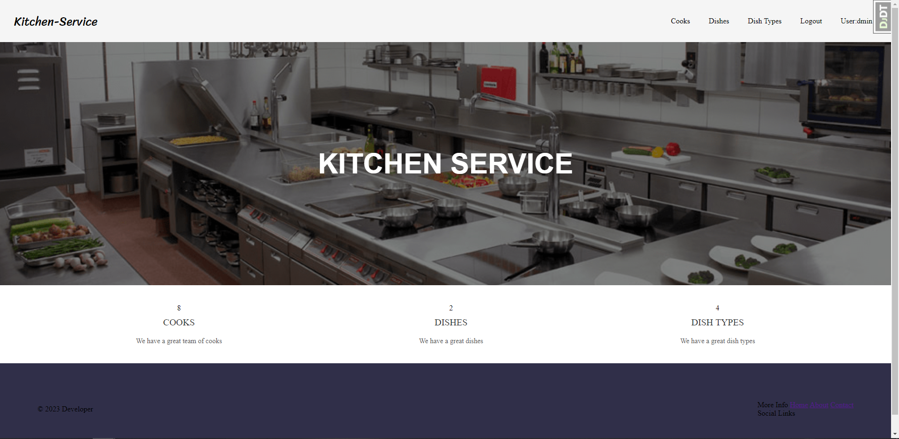
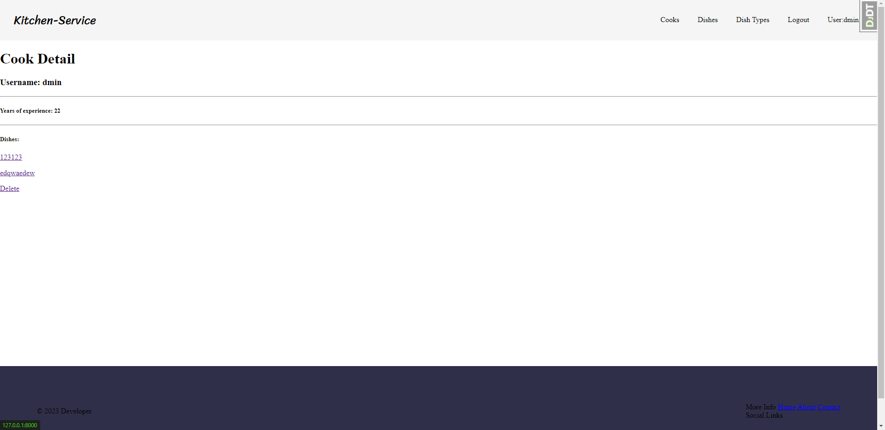
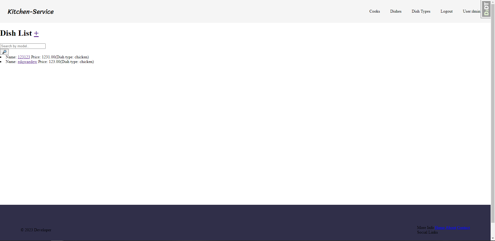
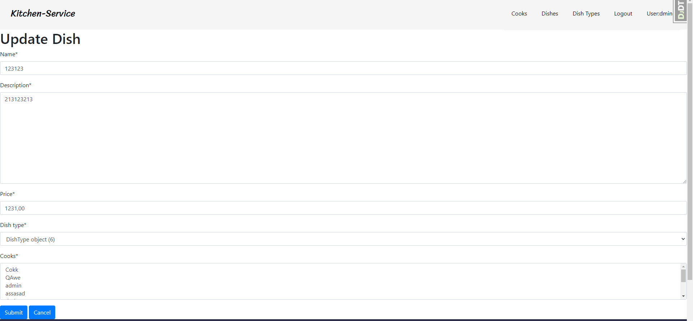
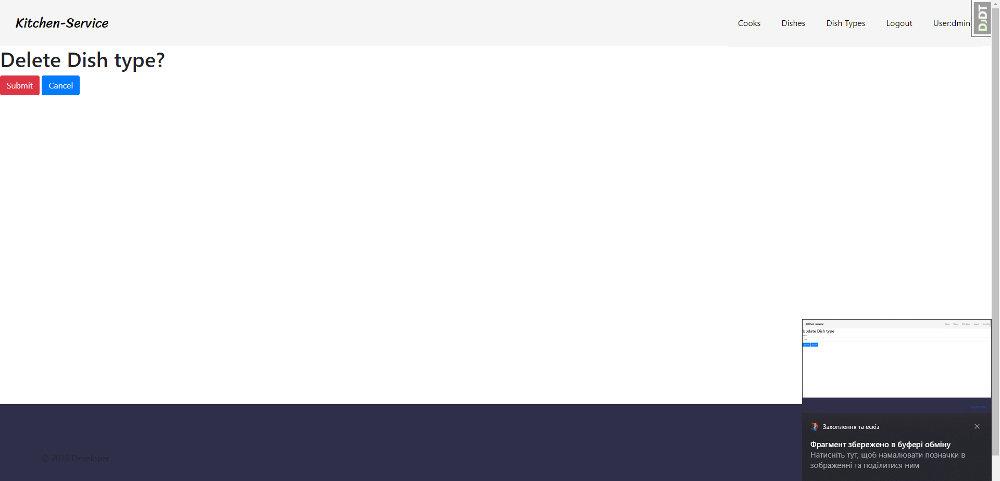

# Restaurant Kitchen Service

Django project for managing dishes and cooks in the Restaurant Kitchen Service

## Try it!

Use the following user to log in and check the functionality of the website: 

```shell
login: Admin
password: q123ewasd
```
## We on Render!
[Restaurant Kitchen service on Render](https://kitchen-4zb6.onrender.com/)
## Installation 

Python3 must be already installed

```shell
git clone https://github.com/Vanya2389/restaurant-kitchen-service.git
cd restaurant-kitchen-service
python3 -m venv venv
source venv/bin/activate  # on macOS
venv\Scripts\activate  # on Windows 
pip install -r requirements.txt
python manage.py migrate
python manage.py runserver #starts Django Server
```

## Secret key
In the main folder, you'll find a file .env_sample. In this file, an example of SECRET_KEY is stored, required for the project.
You may need to create a file .env and write here your secret key as in example.

## Features

* Authentication functionality for Cook/User
* Managing dishes, cooks & dish types directly from the website interface
* Powerful admin panel for advanced managing

## Demo






